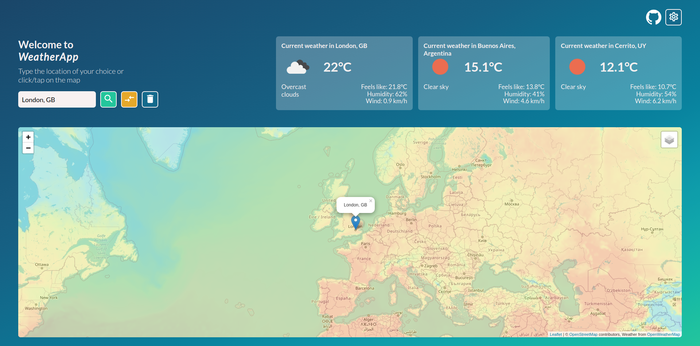
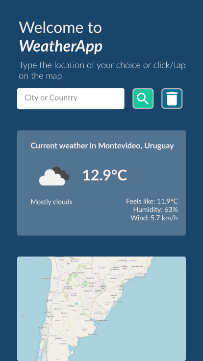
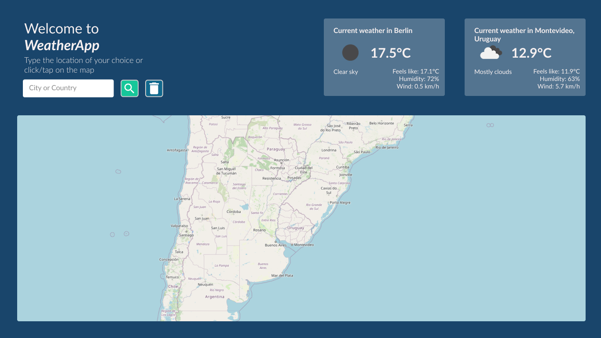

# WeatherApp

Weather app using [Leaflet](https://leafletjs.com/) and [OpenWeatherMap API](https://openweathermap.org/api).

## Table of contents

- [How to run](#how-to-run)
- [Overview](#overview)
  - [The challenge](#the-challenge)
  - [Screenshot](#screenshot)
  - [Link](#link)
- [Our process](#our-process)
  - [Designs with Figma](#designs-with-figma)
  - [Built with](#built-with)
  - [Useful resources](#useful-resources)

## How to run

To run the project in your local server just clone the repo and paste this line on your terminal:

`npm install `

## Overview

### The challenge

- Build out a web app consuming an API. It must have a nice design.

### Screenshot

### Link

- [Deployed in Netlify](https://weatherapp-ria.netlify.app/)

## Our process

### Designs with Figma

### Built with

- Semantic HTML5 markup
- CSS custom properties
- Flexbox and CSS Grid Layout
- Mobile-first workflow
- Typescript
- Leaflet
- SweetAlert2

### Useful resources

- [Platzi](https://platzi.com)
- [MDN Web Docs](https://developer.mozilla.org/en-US/docs/Web/CSS)
